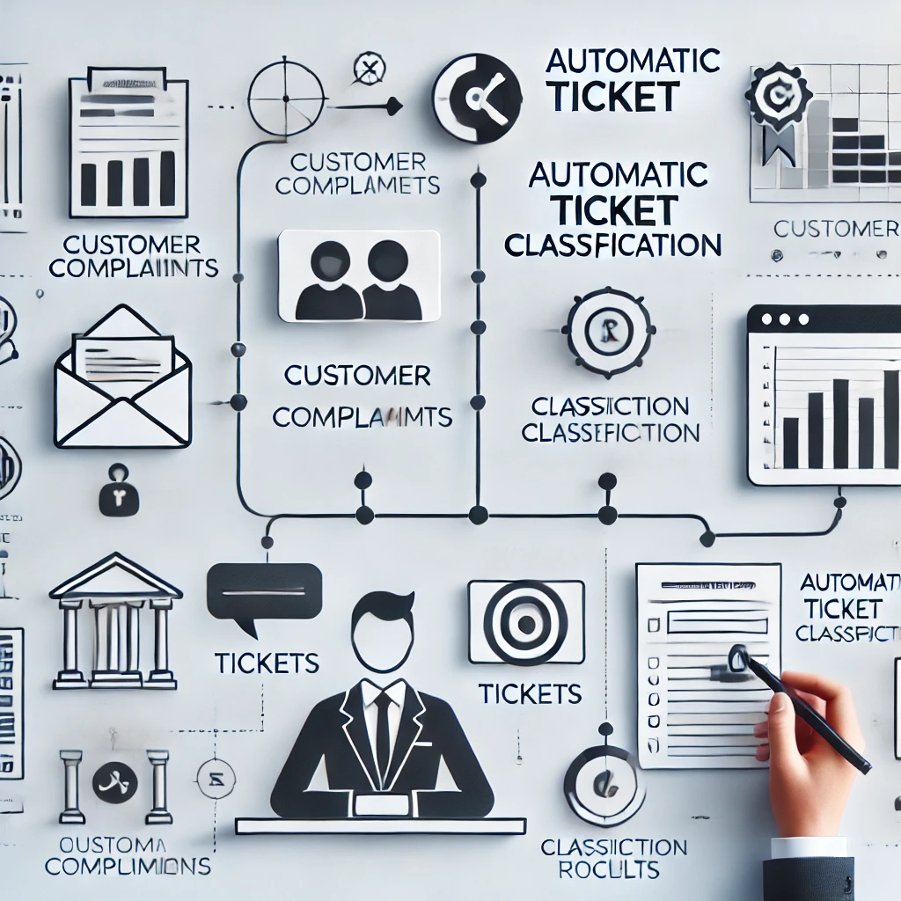
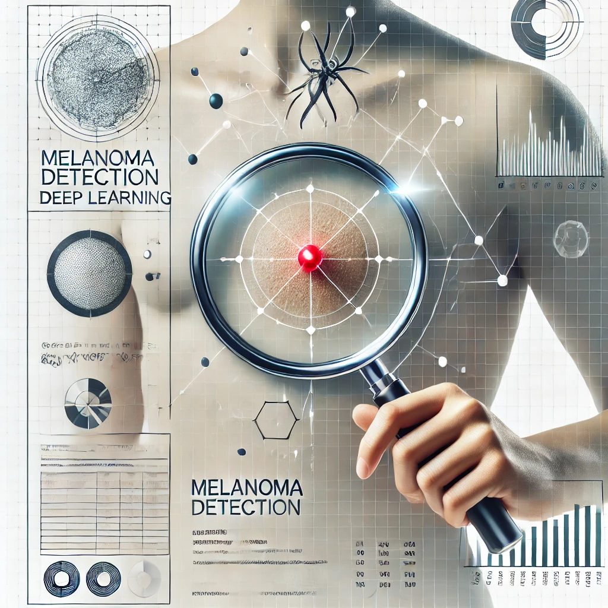
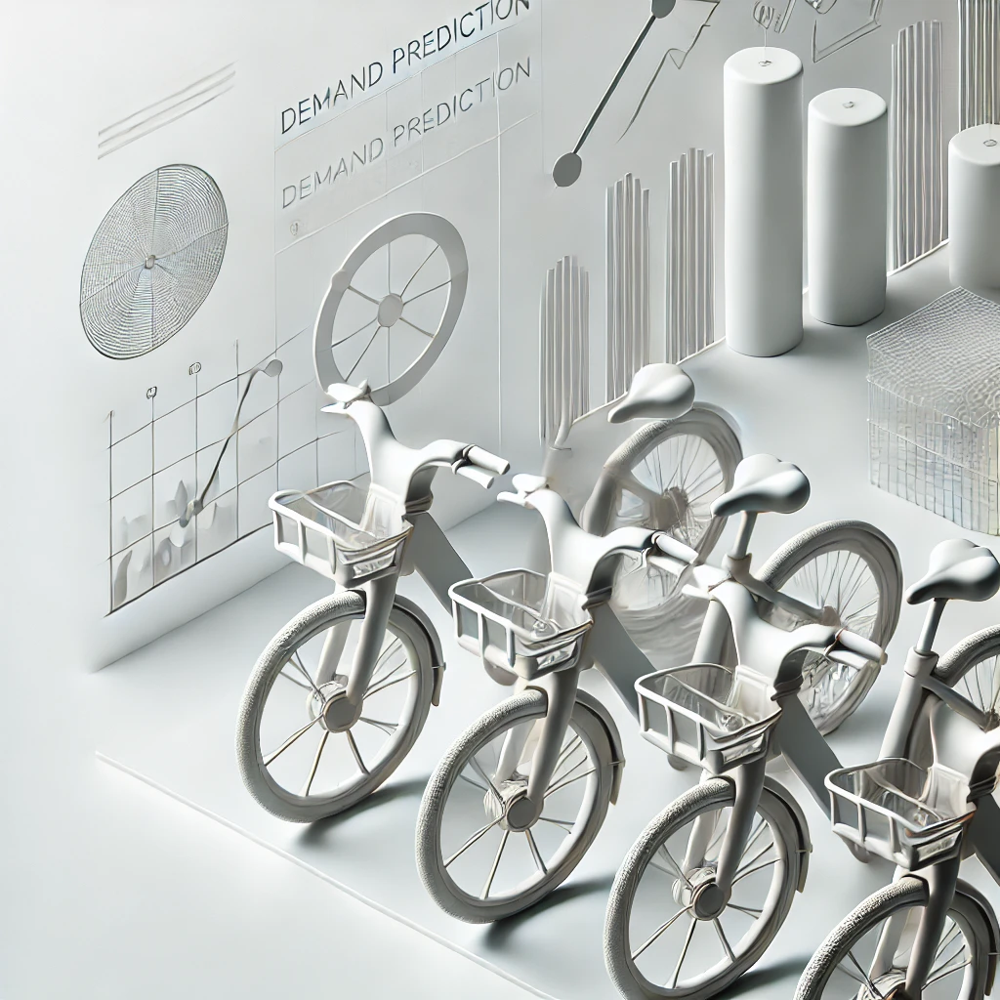

# Headline: 
**Specializing in AI & ML with Python | Microsoft Azure & SoftwareAG Certified | Java WebMethods Integration BPM Consultant**

---

## Navigation
- [About](#about)
- [Skills](#skills)
- [Projects](#projects)
- [Contact](#contact)

---

## About Me {#about}

With over 8 years of experience, I specialize in API integration and AI/ML, delivering innovative solutions for complex technical challenges. As an API and Integration Specialist, I have led large-scale projects, improving system interoperability and reducing deployment times.

I design intelligent systems that automate workflows, enhance decision-making, and provide actionable insights. Passionate about optimization and innovation, I thrive at creating scalable, data-driven solutions that drive operational excellence and measurable business impact.

---

## Key Skills {#skills}

- **AI & Machine Learning**: Python, Machine Learning, Neural Networks, Deep Learning, NLP, Generative AI (GANs, Transformer Models), Model Deployment
- **Data Analysis**: Exploratory Data Analysis (EDA), Predictive Modeling, Data Visualization, Tablau
- **Integration Technologies**: API Development & Integration, WebMethods, BPM, Java, UM, JMS
- **Database**: Oracle, SQL
- **Cloud & DevOps**: Azure DevOps, Cloud Computing

---

## AI/ML Project Portfolio {#projects}

- ### Automatic Ticket Classification

  NLP topic modeling to classify customer complaints based on products and services for improved customer service in the financial sector.  
  **Topics Used**: Natural Language Processing (NLP), Topic Modeling, Scikit-learn, Python.  
  

- ### Gesture Recognition for Smart TVs    

  CNN-based gesture recognition system enabling hands-free control of smart TVs with five distinct gestures.  
  **Topics Used**: Convolutional Neural Networks (CNNs), Time-Series Data, OpenCV, Python.  
  

- ### Medical Text Processing Case Study    

  Custom Named Entity Recognition (NER) system to extract and categorize diseases and treatments from medical text.  
  **Topics Used**: Natural Language Processing (NLP), Named Entity Recognition (NER), spaCy, Python.  
  

- ### Telecom Churn Group Case Study    

  Predictive model to analyze customer churn in the telecom sector, highlighting factors affecting retention.  
  **Topics Used**: Classification Models, Random Forest, EDA, Python.  
  

- ### Melanoma Detection Case Study    

  Deep learning-based model for classifying skin lesions as malignant or benign using medical image data.  
  **Topics Used**: Convolutional Neural Networks (CNNs), Image Augmentation, TensorFlow, Python.  
  

- ### Lending Club Case Study  

  Analysis to identify the key variables contributing to loan defaults, providing insights for risk assessment.  
  **Topics Used**: Exploratory Data Analysis (EDA), Logistic Regression, Decision Trees, Python.  
  

- ### BoomBikes Sharing Case Study  

  Linear Regression model for a US bike-sharing provider to predict demand for efficient operations.  
  **Topics Used**: Linear Regression, Feature Engineering, Data Visualization, Python.  
  

---

## Contact Me {#contact}

- **Email**: [arnabbera.official@gmail.com](mailto:arnabbera.official@gmail.com)  
- **Mobile**: (+91)-8622016168

---

&copy; 2025 Arnab Bera. All rights reserved.
